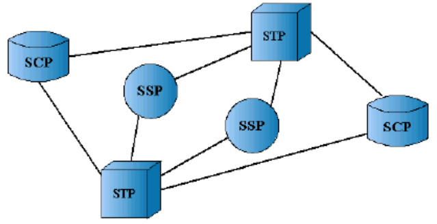
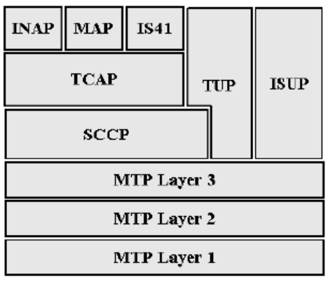
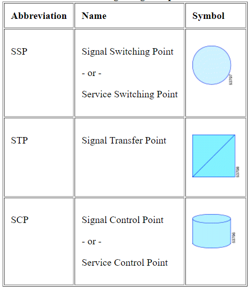
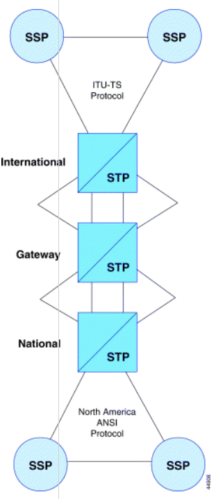

## Introduccion a SS7

El termino SS7 significa Common Channel SIGNLIN sYSTEM 7  y es un sistema de señalización 'out-of-band' que es utilizado en las redes de telefonia de conmutación publica (PSTN) y tambien en las redes mobiles terrestres publicas (PLMN). El SS7 definira prcedimientos de inicialización de conexión, administración y finalización de la conexión, como tambien los protocolos usados para los elementos de la red y el intercambio de factura y enrutamiento de información. El SS7 tambien es usado en los servicios de redes inalambricas, tales como los servicios de comunicación personal como roaming autenticación a suscriptores móviles. Los mensajes SS7 son transferidos por una lógica de redes digitales que existen con una red de telecomunicaciones con portadores de voz y audio.

El SS7 es un estandar definido por la ITU y es un estandar de tipo ITU-T, aunque pueden existir variantes en diferentes paises como el ANSI (American National Standars Institute) y los estandares Bellcore usados en Norteamerica, y en europa la ETSI (European Telecommunications Standars Institute) usado en Europa.

Dentro del SS7, se puede distinguir 3 componentes:

1. SSPs (Puntos de Conmutación de Servicio)
2. STPs (Puntos de Transferencia de Servicio)
3. SSPs (Puntos de Control de Servicio)

Los SSPs son conmutadores de voz con el stack o pila protocolar SS7, interconectando por enlaces de señalización. Los SSPs crean mensajes con señalización *call-related* y se envian entre ellos a otros SSPs o realizan consultas remotas con bases de datos compartidas en los SCPs para encontrar como se peude llamar una ruta.

Los STPs son paquetes de conmutación, pero ellos solo actuan como enrutadores en los mensajes de señalización. Ellos retardan los mensajes SS7 entre los SSPs y las bases de datos remotas.
Los STPs usualmente no originan mensajes de señalización.

Los SCPs son interfaces para bases de datos especificas, estos aceptan peticiones de los SSPs y retornan información solicitada de las bases de datos. Los ejemplos tipicos de bases de datos especificas son los **Home Location Register** (HLR), los Visitors Location Register (VLR) y los Equipment Identity Register (EIR). Estas bases de datos son elementos estandar de redes GSM y del GPRS.

La pila protocolar del SS7 consiste en cuatro niveles, son 3 de mas bajo nivel son una combinación de un conjunto de protocolos, llamados los *Message Transfer Part* (MTP). Estos MTP son una division entre el nivel 1 al 3, correspondientemente a los 3 primeros niveles del modelo OSI, el nivel 4 consiste en protocolos estrictos como lo son el *Signaling Connection Control Part* (SCCP), el *Telephone User Part* (TUP), *ISDN User Part* (ISUP), *Intelligent Network Application Protocol* (INAP), y la *EIT/TIA interim standard 41* (IS41).

MAP se encuentra en el nivel 4 del stack del SS7, este provee el procedimiento de administración de localización, datos de subscribción, autenticación, resolución de llamadas, trazados de subscripciones, y el sevicio de mensajes cortos (SMS). 

Este es un rol importante para el procedimiento de resolución de movilidad usado para la subscripción de moviles de una area de conmutación a otra. Este perfil de subscripción es resuelta del HLR usando información MAP llevada por mensajes TCAP (Transaction Capabilities Application Part) . 

El TCAP es una aplicación protocolar que puede ser usada en varias aplicaciones, es provee servicios que permiten una aplcacion para que un nodo invoque la ejecución de un prodecimiento a un nodo remoto y que intercambie los resultados de como se realiza dicha invocación. *El rol mayor del TCAP es facilitar las transacciones con una base de datos externa*.

## Arquitectura de la Señalización SS7
Como se menciono en la introducción la arquitectura SS7 consiste en 3 componentes interconectados con una via de enlace (SSP, STP, SCP) donde podemos caracterizarlos por una tabla y su figura esquematica.

### Signal Switching Point (SSP)
Este sera un conmutador que tiene un software SS7 y los enlaces de señalización de terminación, es puede ser conmunado con un conmutador de voz/SS7 o adjuntado a un sistema computacional conectado a un conmutador de voz.

Los SSPs crean paquetes y envia esos mensajes a otros SSPs, como tambien consultas de bases de datos compartidas para encontrar como seguir una ruta de llamada, es decir **ellos puede originar, terminar o conmutar llamadas**.

La comunicación entre SSPs con los conmutadores de voz es a traves del uso de mensajes usando los protocolos de ISUP (call setup) y el TCAP (buscador de bases de datos).

### Signal Transfer Point (STP)
El STPs son conmutadores de paquetes, y su actuan como enturadores en las redes SS7. Algo para distinguirles es que los mensajes no son orignados por el STP, si no que el STP puede actuar con el enrutador, firewall y captura de mensajes con otras redes.

El STPs enruta los mensajes SS7 que esta basada en información contenida en un formato de mensajes y los dirige con elances de señalización sobre la red SS7. Dicho formato de mensajeria es mas versatil de todas las entidades SS7, y son un mayor componente en las redes.

Los STP tienen 3 niveles:

1. National Signal Transfer Point
2. International Signal Transfer Point
3. Gateway Signal Transfer Point

### Signal Control Point (SCP)

## Pila o Stack Protocolar SS7
## Unidades de Señal SS7
## ISUP y TCAP
